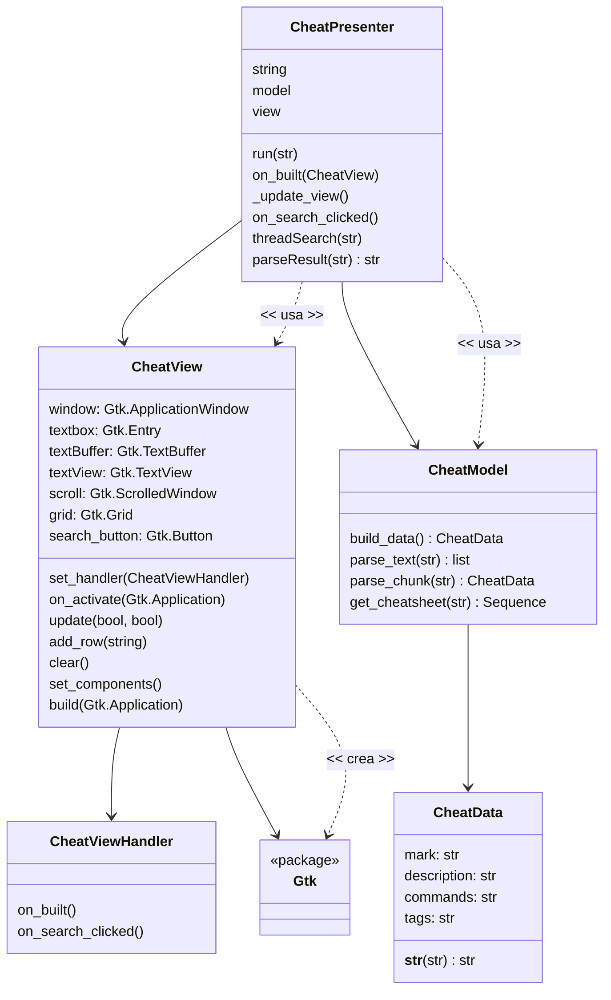
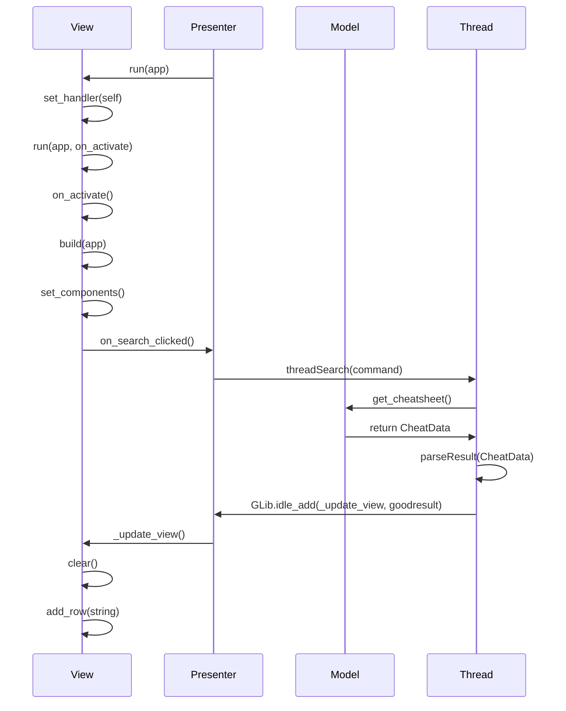

# Diseño software

## Tarea 1: Diseño software e implementación

Seleccionamos el patrón arquitectónico de **modelo-vista-presentador**  ([MVP](https://en.wikipedia.org/wiki/Model%E2%80%93view%E2%80%93presenter))

En este patrón el modelo se encarga de definir los datos que se mostrarán,
el presentador recoge los datos del modelo y los formatea para que sean mostrados por la vista.

## Estático

## Dinamico

